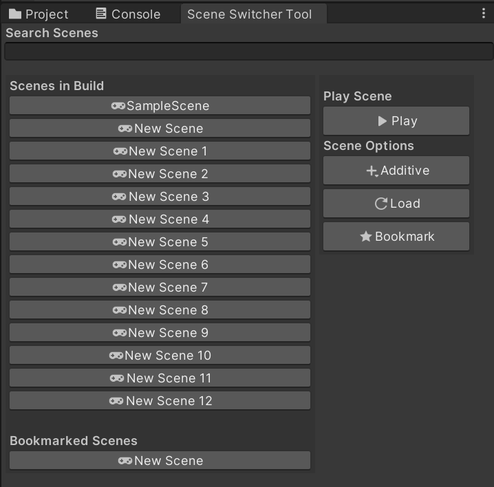
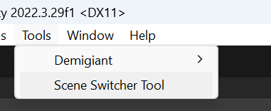
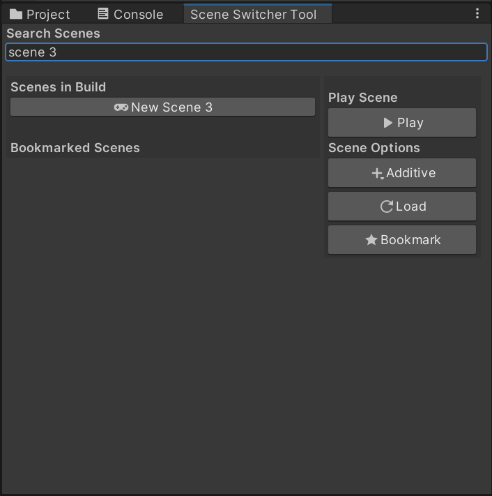

# Scene Switcher Tool

## Overview

The Scene Switcher Tool is a custom Unity Editor tool designed to simplify the process of switching between scenes during development. It allows users to quickly switch to any scene in the build settings, load scenes additively, and bookmark frequently used scenes for easy access.

## Features

- **Search Scenes**: Quickly find scenes using the search bar.
- **Toggle Scenes**: Select a scene using toggle buttons with icons.
- **Play Scene**: Play the selected scene.
- **Load Scene Additively**: Load the selected scene additively.
- **Load Scene Without Playing**: Load the selected scene without entering play mode.
- **Bookmark Scenes**: Bookmark frequently used scenes for easy access.

## How to Use

1. **Open the Scene Switcher Tool**:
   - Go to `Tools > Scene Switcher Tool` in the Unity Editor menu.

2. **Search for a Scene**:
   - Use the search bar at the top of the tool window to filter scenes by name.

3. **Select a Scene**:
   - Click the toggle button next to the scene name. The button has an icon for better visibility.
   - Only one scene can be selected at a time.

4. **Play the Scene**:
   - Click the "Play" button to open the selected scene and enter play mode.

5. **Load the Scene Additively**:
   - Click the "Additive" button to load the selected scene additively.

6. **Load the Scene Without Playing**:
   - Click the "Load" button to open the selected scene without entering play mode.

7. **Bookmark a Scene**:
   - Click the "Bookmark" button to add the selected scene to the bookmarked scenes list.
   - Bookmarked scenes are saved and will be available the next time you open the tool.

## UI Layout

- **Scenes in Build**:
  - A list of all scenes in the build settings, displayed with toggle buttons and icons.

- **Bookmarked Scenes**:
  - A list of bookmarked scenes for quick access.

- **Action Buttons**:
  - Play: `d_PlayButton` icon
  - Load Additively: `d_Toolbar Plus More` icon
  - Load: `d_Refresh` icon
  - Bookmark: `Favorite` icon

## Screenshots

#### Main Tool Window

#### Open Tool

#### Search Buttons

## Installation
#### Instal without Unity Package File
1. Download the `SceneSwitcherTool.cs` script.
2. Place the script in the `Editor` folder of your Unity project.

#### Install with Unity Package File
1. Download the "SceneSwitcherTool.unitypackage" at [Google Drive](https://drive.google.com/file/d/1wcIiwV_ALzPnVFkPxEoZRPsTzWlzoAdY/view?usp=sharing)
2. Place the unitypackage in the project tab in Unity Project.

# Developer : https://github.com/billtruong003
